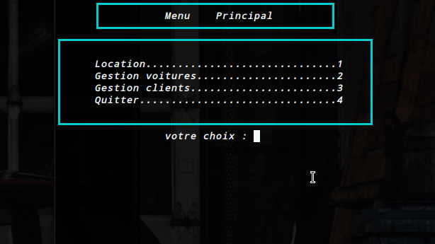
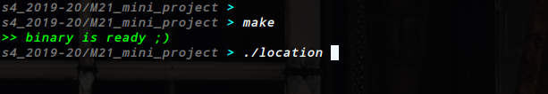

  
  

Programmation 02, Mini Projet.
======================
    
 Sunday, 29. March 2020 12:16am 
      
[This Project](https://github.com/mohamedLazyBob/M21_mini_project) is Mini project I'm asked to do at my Programming module in the university of Ibn-Zohr AGADIR, the main goal of this is to create a terminal application that can Do **car rental management.**

 

 	

## Table of content

- [Installation](#installation-guide)
- [Usage](#how-to)
- [Compatibility](#compatibility)
- [License](#license)
- [Statement](#Project-sheets)

 
 

## Installation Guide

1.  download this repo
	- `` git clone https://github.com/mohamedLazyBob/M21_mini_project ``
	-  Click On the Download button. 
2.  Run the command `make` inside the folder.
3.  Execute the executable that's called `location`, like this : `./location`

 

		

### How to
- `make all` Or `make` : To compile everything.
- `make clean` : To delete the object files.
- `make fclean` : To delete everything.

## Compatibility
- *I have tested this On **MacOs** and **Linux** (Ubuntu 19), on those I guarantee that it'll work fine.
For windows, I don't have acces to a machine like that for now, so the behavior is undifined*
- Please if you find anything wrong, not properly working DM.

## License
MIT License

Copyright (c) 2020 MOHAMED ZABOUB

Permission is hereby granted, free of charge, to any person obtaining a copy
of this software and associated documentation files (the "Software"), to deal
in the Software without restriction, including without limitation the rights
to use, copy, modify, merge, publish, distribute, sublicense, and/or sell
copies of the Software, and to permit persons to whom the Software is
furnished to do so, subject to the following conditions:

The above copyright notice and this permission notice shall be included in all
copies or substantial portions of the Software.

THE SOFTWARE IS PROVIDED "AS IS", WITHOUT WARRANTY OF ANY KIND, EXPRESS OR
IMPLIED, INCLUDING BUT NOT LIMITED TO THE WARRANTIES OF MERCHANTABILITY,
FITNESS FOR A PARTICULAR PURPOSE AND NONINFRINGEMENT. IN NO EVENT SHALL THE
AUTHORS OR COPYRIGHT HOLDERS BE LIABLE FOR ANY CLAIM, DAMAGES OR OTHER
LIABILITY, WHETHER IN AN ACTION OF CONTRACT, TORT OR OTHERWISE, ARISING FROM,
OUT OF OR IN CONNECTION WITH THE SOFTWARE OR THE USE OR OTHER DEALINGS IN THE
SOFTWARE.

## Project sheets

* [Project pdf](./etc/M23_mini_Cars_location_project.pdf)
